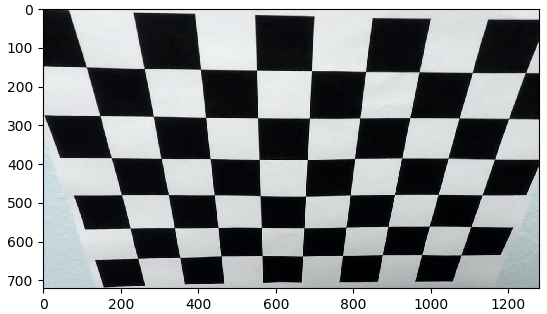
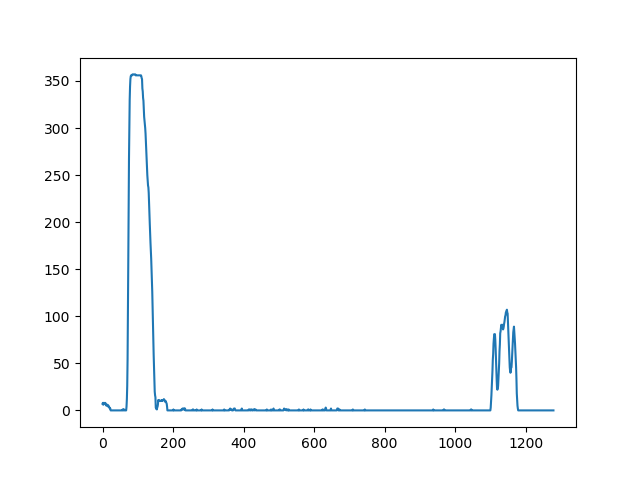
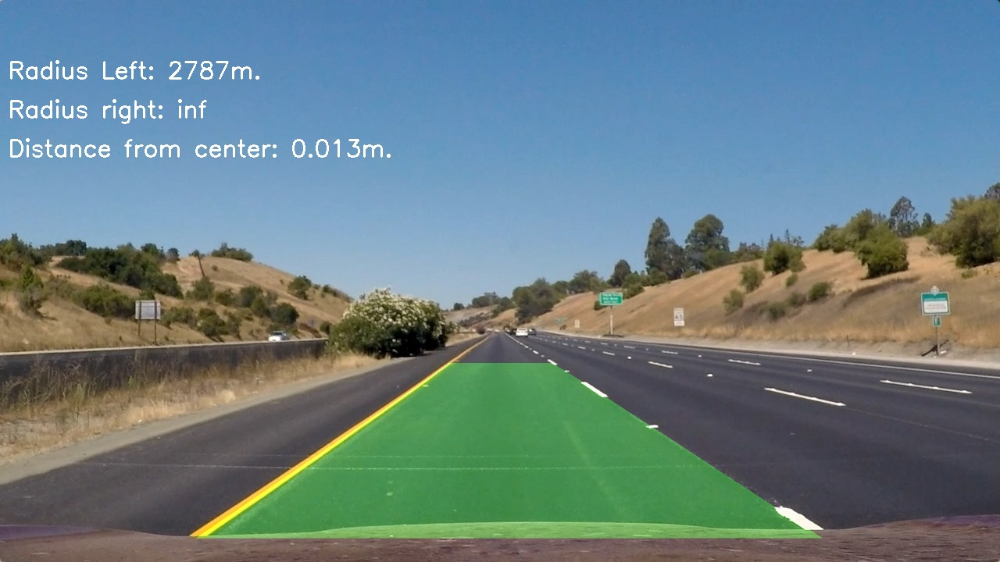

**Advanced Lane Finding Project**

The goals / steps of this project are the following:

* Compute the camera calibration matrix and distortion coefficients given a set of chessboard images.
* Apply a distortion correction to raw images.
* Use color transforms, gradients, etc., to create a thresholded binary image.
* Apply a perspective transform to rectify binary image ("birds-eye view").
* Detect lane pixels and fit to find the lane boundary.
* Determine the curvature of the lane and vehicle position with respect to center.
* Warp the detected lane boundaries back onto the original image.
* Output visual display of the lane boundaries and numerical estimation of lane curvature and vehicle position.

### Camera Calibration

#### In order to get reliable results it is needed to properly calibrate the camera.

The code responsible for this part is in functions.py, line16 (calibrateCamera()).

I start by preparing "object points", which will be the (x, y, z) coordinates of the chessboard corners in the world. Here I am assuming the chessboard is fixed on the (x, y) plane at z=0, such that the object points are the same for each calibration image.  Thus, `objp` is just a replicated array of coordinates, and `objpoints` will be appended with a copy of it every time I successfully detect all chessboard corners in a test image.  `imgpoints` will be appended with the (x, y) pixel position of each of the corners in the image plane with each successful chessboard detection.  

I then used the output `objpoints` and `imgpoints` to compute the camera calibration and distortion coefficients using the `cv2.calibrateCamera()` function.  

Before undistortion:

After undistortion:

Calibration of the camera is done only once when the program starts. 

## Pipeline description

The pipeline function can be found in AdvancedLineDetection.py, line 61.

It consists of several steps leading to the final result. All the steps are described below.

### 1. In the first step the image is undistored using coefficients calculated in calibrateCamera()

This operation is porformed in AdvancedLineDetection.py in line 64.

Image before undistortion:

Image after undistortion:

### 2. In the second step I do apply gradient and color thresholding in order to extract lines on the image. 

#### This is done in the functions.py, line 47, apply_threshold_operations()

Gradient thresholding is done as follows
1. Take the undistorted raw image and convert it to grayscale.
2. Apply cv2.Sobel() function to calculate the derivative in x and take the absolute value of it. Later scale the values to the range (0, 255)
3. Apply the threshold (I used low_thr=20 and high_thr = 100) and create binary image containing all the pixels that values lie within the threshold.

Color thresholding is done as follows:
1. Transform the undistorted image from RGB to HLS color space
2. select the S channel (saturation) - in this channel the lines are visible better than on the other ones
3. Similarly as in the gradient example, apply threshold (I selected min=90 and max=255) and create binary image containing the pixels which values are within the threshold.

The last step in this function is combining both binary images to get final combined_threshold image.

### 3. In the third step the perspective transform is applied to the combined_binary image in order to get top-down view of the road.

#### This is done in functions.py, line 88, function apply_perspective_transform()

In order to perform the perspective transform I chose the corresponding pixels on the source and destination images. These are following points:

| Source        | Destination   | 
|:-------------:|:-------------:| 
| 231, 690      | 200, 720      | 
| 1075, 690     | 200, 0        |
| 713, 465      | 1080, 0       |
| 570, 465      | 1080, 720     |

In order to check wheteher the perspective transform works properly, I draw the lines with ends in the source points on the source image and transformed it to top-down view. I excpect the lines to be close to parallel on the ransformed image.

### 4. In the fourth step I search for the lines in the image and fit a polynomial to the found line points.

If there is no previous detection available, I use the sliding window algorithm to find the line points on the image. This is realized in functions.py, line 133, function fit_polynomial_init(). This is done in following steps:

function called find_lane_pixels_sliding_windows(), line 185
1. calculate the histogram on the lower half of the image and select the maximum values as the approximate x location of the lines. The peak to the left is the location of the left line, peak to the right - of the right line.

2. Define number of the sliding windows to use (in my example 9) as well as the margin (width of the window) and min_pix (min number of pixels that have to be found in the window in order to shift it horizontally.

3. For every window the pixels lying within the window are selected. If the number of pixels is larger than min_pix, the next windows x-position is adapted accorrdingly based on the pixels mean position.

4. Lists with all valid pixels for left and right lines are created.

5. In the next step the 2nd order polynomial is fitted to the previously found points (functions.py, line 158) and the result is plotted on the image (functions.py, line 150)

After the initial detection another function can be used for next frames as there is no need to always apply the sliding windows algorithm. Instead it is possible to search for new lines close to the ones from the previous frame. This is realized in the function search_around_poly() (functions.py, line 310) in the following steps.

1. Get the previous polynomial coefficients and create a tube in the defined margin around the lines.

2. Search for the pixels in the tube and save them in the lists.

3. Fit a new polynomial based on the newly found pixels.

### 5. Measuring curve radius and distance from the centre of the car to the center of the line.

In order to calculate the distance of the car relative to the center of the line I take the X position of the lines and calculate the offset as (functions.py, line 172):

offset_m = (offset_left - offset_right) * xm_per_pix

where:

offset_left = (center - left_fitx[-1])

offset_right = (right_fitx[-1] - center)

xm_per_pix - factor for calculating pixel-distance into meters

center = image_width/2 -> assumption that camera is mounted exactly in the middle of the car

Calulating the curvature of the lines is done in functions.py, line 395, function measure_curvature_real(). It provides the curvature in meters using the following formula to calculate it:

$R = \frac{(1+(2Ay+B)^2)^{3/2}}{|2A|}$

where:
A, B - polynomial coefficients

### 6. Warping the calculated lines back to the original and write measured information on the image

Reprojecting of the polygon defining line boundaries back into original camera view is done in function reproject_lines(), functions.py, line 420. It uses the inverse transformation matrix Minv and cv2.warpPerspective() functions to achieve this. At the end it uses cv2.addWeighted() function to overlay this polygon on the original image.

The last step is putting the curvature and distance to center information on th eimage. This is done in write_measured_info() function in functions.py, line 444. In case when the curvature is larger than 5000m (almost straight line) the description is set to 'inf'.

### Running on photos and vides - example output

The pipeline described above can be run on the images or videos. In AdvancedLineDetection.py there are 2 functions coping with that: run_on_images() (line 94) and run_on_video() (line 107)
below the output for the project test images and video is presented. As can be seen, the detection is stable and fulfills project requirements.

### Test Images:

### Project Video

<a href="https://www.youtube.com/watch?feature=player_embedded&v=Hc3cDUYkAg0" target="_blank"> Watch video on YouTube</a>
